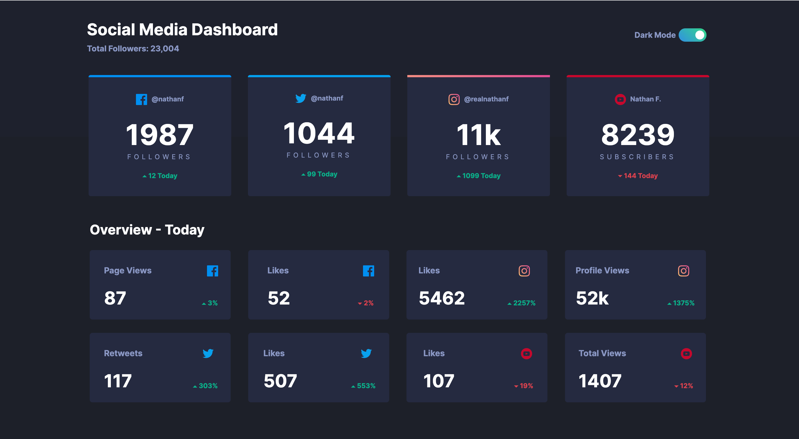

# Frontend Mentor - Social media dashboard with theme switcher solution

This is a solution to the [Social media dashboard with theme switcher challenge on Frontend Mentor](https://www.frontendmentor.io/challenges/social-media-dashboard-with-theme-switcher-6oY8ozp_H). Frontend Mentor challenges help you improve your coding skills by building realistic projects. 

## Table of contents

- [Overview](#overview)
  - [The challenge](#the-challenge)
  - [Screenshot](#screenshot)
  - [Links](#links)
- [My process](#my-process)
  - [Built with](#built-with)
  - [What I learned](#what-i-learned)
  - [Useful resources](#useful-resources)
- [Author](#author)
<br/><br/>

## Overview

### The challenge

Users should be able to:

- View the optimal layout for the site depending on their device's screen size
- See hover states for all interactive elements on the page
- Toggle color theme to their preference
<br/>

### Screenshot

<details>
<summary>Light Theme</summary>


</details>
<details>
<summary>Dark Theme</summary>


</details>
<br/>

### Links

- Solution URL: [Here](https://github.com/lcmedina/social-dashboard)
- Live Site URL: [Here](https://socialmeddash.netlify.app/)
<br/>

## My process
<br/>

### Built with

- Semantic HTML5 markup
- CSS custom properties
- CSS Grid
- Web-first workflow

<br/>

### What I learned

I challenged myself to create a light and dark mode feature using pure JavaScript. 
First I created a function to set the local storage key pair value for the theme.
```js
function setTheme(theme) {
      localStorage.setItem('theme', theme);
      document.documentElement.className = theme
    }
```
Then I needed a function to actually toggle the themes. So we check to see what local storage is currently at and set the opposite accordingly.
```js
function toggleTheme() {
      if (localStorage.getItem('theme') === 'darkTheme') {
        setTheme('lightTheme')
      } else {
        setTheme('darkTheme')
      }
    }
```
Lastly, on page load we check to see what local storage was set at the last time the user was on the site and set the theme.
```js
(function () {
      if (localStorage.getItem('theme') === 'darkTheme') {
        setTheme('darkTheme')
      } else {
        setTheme('lightTheme')
      }
    })();
```
<br/>

### Useful resources

- [CSS Grid](https://www.w3schools.com/css/css_grid.asp) - Helpful resource for learning and refreshing the basics of CSS Grid.
- [Checkbox to Toggle](https://www.w3schools.com/howto/howto_css_switch.asp) - Walked me through turning a checkbox into a toggle button using pure CSS.
<br/>

## Author

- Website - [Laura Medina](https://www.laurachristine.net)
- Frontend Mentor - [@lcmedina](https://www.frontendmentor.io/profile/yourusername)


